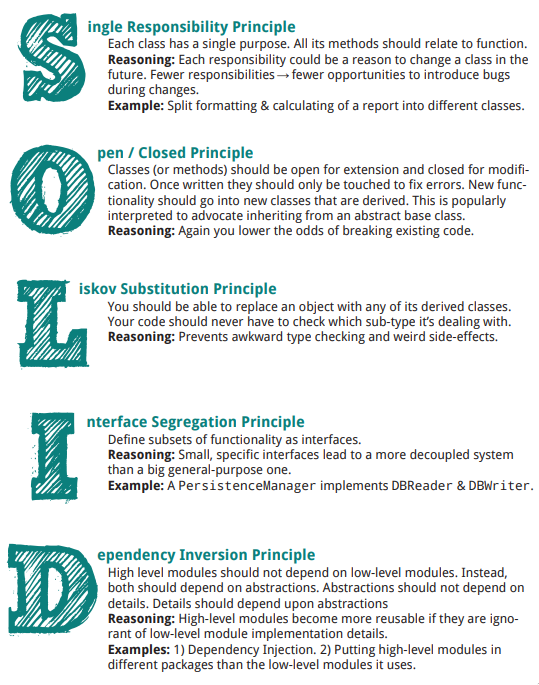

# Design Patterns in Golang

One of the most resourceful implementations of design patterns in golang

## TOC

- [SOLID Principles](#solid-principles)
  - [Single Responsibility Principle](#single-responsibility-principle)
  - [Open Closed Principle](#open-closed-principle)
  - [Liskov Substitution Principle](#liskov-substitution-principle)
  - [Interface Segregation Principle](#interface-segregation-principle)
  - [Dependency Inversion Principle](#dependency-inversion-principle)
- [Creational](#creational)
  - [Abstract Factory](#abstract-factory)
  - [Builder](#builder)
  - [Factory](#factory)
  - [Object Pool](#object-pool)
  - [Prototype](#prototype)
  - [Singleton](#singleton)
- [Structural](#structural)
  - [Adapter](#adapter)
  - [Bridge](#bridge)
  - [Composite](#composite)
  - [Decorator](#decorator)
  - [Facade](#facade)
  - [Flyweight](#flyweight)
  - [Private Class Data](#private-class-data)
  - [Proxy](#proxy)
- [Behavioural](#behavioural)
  - [Chain of responsibility](#chain-of-responsibility)
  - [Command](#command)
  - [Interpreter](#interpreter)
  - [Iterator](#iterator)
  - [Mediator](#mediator)
  - [Memento](#memento)
  - [Null Object](#null-object)
  - [Observer](#observer)
  - [State](#state)
  - [Strategy](#strategy)
  - [Template Method](#template-method)
  - [Visitor](#visitor)
- [Microservices](#microservices)
  - [Circuit Breaker](#circuit-breaker)
  - [Publish Subscribe](#publish-subscribe)
  - [Service Registry](#service-registry)
- [UML](#uml)
  - [Requirement Specification](#requirement-specification)
  - [Use case](#use-case)
  - [Acitivity Diagram](#activity-diagram)
  - [Sequence Diagram](#sequence-diagram)
  - [Class Diagram](#class-diagram)
- [Credits](#credits)

## SOLID Principles



### Single Responsibility Principle


### Open Closed Principle


### Liskov Substitution Principle


### Interface Segregation Principle


### Dependency Inversion Principle


## Creational Patterns

### Abstract Factory

Creates an instance of several families of classes.

### Builder

Separates object construction from its representation.

### Factory

Create an instance of several derived classes.

### Object Pool

Avoid expensive acquisition and release of resources by recycling objects

### Prototype


The Prototype Pattern creates duplicate objects while keeping performance in mind.

- It requires implementing a prototype interface which tells to create a clone of the current object.
- It is used when creation of object directly is costly.

For instance, an object is to be created after a costly database operation. We can cache the object, returns its clone on next request and update the database as and when needed thus reducing the database calls.

**Example - 1**: generate different configuration files depending on our needs

``` go
package configurer

type Config struct {
	workDir string
	user string
}


func NewConfig(user string, workDir string) Config {
	return Config{
		user: user,
		workDir: workDir,
	}
}

func (c Config) WithUser(user string) Config {
	c.user = user
	return c
}

func (c Config) WithWorkDir(workDir string) Config {
	c.workDir = workDir
	return c
}

```

We want to be able to mutate the object without affecting its initial instance. The goal is to be able to generate different configuration files without loosing the flexibility of customizing them without mutation of the initial default configuration.

### Singleton

- only one instance
- global point to access the instance
- initialization on first use

If app needs one and only one instance of an object.

``` go
type privateStructure struct {
	value string
}

var singleVariable privateStructure

func GetSingletonInstance() privateStructure {
	if singleVariable != nil {
		return singleVariable
	}

	singleVariable = privateStructure{
		value: "some data",
	}

	return singleVariable
}
```

A thread-safe solution might be

``` go
var mu sync.Mutex

func GetInstance() *singleton {
	mu.Lock()
	defer mu.Unlock()
	
	if instance == nil {
		instance = &singleton{}
	}
	
	return instance
	
}
```

`Check-Lock-Check` Pattern

``` go
func GetInstance() *singleton {
	
	if instance == nil {
		mu.Lok()
		defer mu.Unlock()
		
		if instance == nil {
			instance = &singleton{}
		}
	}
	
	return instance
}
```

But using the sync/atomic package, we can atomically load and set a flag that will indicate if we have initialized or not our instance.

``` go
import sync
import sync/atomic

var initialized uint32

func Getinstance() *singleton{
	if atomic.LoadUInt32(&initialized) == 1 {
		return instance
	}
	
	mu.Lock()
	defer mu.Unlock()
	
	if initialized == 0 {
		instance = &singleton{}
		atomic.StoreUint32(&initialized, 1)
	}
}
```

Idiomatic singleton approach in go

``` go
package singleton

import (
	"sync"
)


type singleton struct {}

var instance *singleton
var once sync.Once

func GetInstance() *singleton {
	once.Do(func(){
		instance = &singleton
	})
	return instance
}
```

Example Code

``` go
package main

import (
	"fmt"

	"github.com/alamin-mahamud/go-design-patterns/singleton"
)

func main() {
	s := singleton.GetInstance()
	s.Data = 1
	fmt.Println("1st -> ", s.Data)

	s2 := singleton.GetInstance()
	fmt.Println("2nd -> ", s2.Data)

	s3 := singleton.GetInstance()
	fmt.Println("3rd -> ", s3.Data)

	s2.Data = 20
	fmt.Println("1st -> ", s.Data)
	fmt.Println("2nd -> ", s2.Data)
	fmt.Println("3rd -> ", s3.Data)

	s3.Data = 10
	fmt.Println("1st -> ", s.Data)
	fmt.Println("2nd -> ", s2.Data)
	fmt.Println("3rd -> ", s3.Data)

}
///////////////////////////////////////////
// 1st ->  1
// 2nd ->  1
// 3rd ->  1
// 1st ->  20
// 2nd ->  20
// 3rd ->  20
// 1st ->  10
// 2nd ->  10
// 3rd ->  10
////////////////////////////////////////////
```

## Structural Patterns

Ease the design by identifying a simple way to realize relationships between entities.

### [Adapter](#adapter)

Match interfaces of different classes.

### [Bridge](#bridge)

Separate an object's interface from it's implementation

### [Composite](#composite)

A tree structure of simple and composite objects.

### [Decorator](#decorator)

Add responsibilities to objects dynamically.

### [Facade](#facade)

A single class that represents an entire subsystem.

### [Flyweight](#flyweight)

A fine-grained instance used for efficient sharing.

### [Private Class Data](#private-class-data)

Restricts accessor/mutator access.

### [Proxy](#proxy)

An object representing another object.

## Behavioural Patterns

### [Chain of responsibility](#chain-of-responsibility)

A way of passing a request to a chain of objects.

### [Command](#command)

Encapsulates a command request as an object

### [Interpreter](#interpreter)

A way to include language elements in a program.

### [Iterator](#iterator)

Sequentially access the elements of a collection.

### [Mediator](#mediator)

Defines simplified communication between classes.

### [Memento](#memento)

Capture and restore an object's internal state.

### [Null Object](#null-object)

Designed to act as a default value of an object.

### [Observer](#observer)

A way of notifying change to a number of classes.

### [State](#state)

Alter an object's behaviour when it's state change.

### [Strategy](#strategy)

Encapsulates an algorithm inside a class.

### [Template Method](#template-method)

Defer the exact steps of an algorithm to a subclass.

### [Visitor](#visitor)

Defines a new operation to a class without change.

## Microservices

### Circuit Breaker

### Publish Subscribe

[Placeholder ...]

### Service Registry

[Placeholder ...]

## UML

### Requirement Specification

- Who is specifying it
- For Whom this is being specified
- What is specified.

### Use case

What the system does for a user.

- **Scenario**:
  - A patient calls the clinic to make an appointment for a yearly checkup.
  - The receptionist finds the nearest empty slot in the appointment book and schedules the appointment in that time slot.
  
  

#### Constructing Use Case

- Collect information sources - How Am I supposed to know that?
- Identify potential actors - Which partners and customers use the goods and services of the business system
- Identify potential business use cases - Which goods and services actor can draw upon?
- Connect business use cases - Who can make use of what goods and services of the business system?
- Describe Actors - Who or what do the actors represent?
- Search for more business use cases - what else needs to be done?
- Edit Business use cases - what actually has to be included in a business use case?
- Document business use cases - What happens in a business use case?
- Model Relationships between business use cases - What activities are conducted repeatedly?
- Verify the view - Is everything correct?

### Activity Diagram


#### Constructing activity diagrams in the external view

- collect information sources - how am i supposed to know that?
- find activities and actions - what has to be done when actors draw upon offered goods and services?
- adopt actors from business use cases - who is responsible for each action?
- connect actions - in which order are actions processed?
- refine activitiess - do any other activity diagrams have to be added?
- verify the view - is everything correct?

### Sequence Diagrams


#### Constructing Sequence Diagram

- Designate actors and business system—Who is taking part?
- Designate initiators—Who starts interactions?
- Describe the message exchange between actors and business system—Which messages are being exchanged?
- Identify the course of interactions—What is the order?
- Insert additional information—What else is important?
- Verify the view—Is everything correct?


### Class Diagram


**Association** - a relationship between instances of the two classes. There is an association between two classes if an instance of one class must know about the other in order to perform its work. In a diagram, an association is a link connecting two classes.

**Aggregation** - an association in which one class belongs to a collection. An aggregation has a diamond end pointing to the part containing the whole. In our diagram, Order has a collection of OrderDetails.

**Generalization** - an inheritance link indicating one class is a superclass of the other. A generalization has a triangle pointing to the superclass. Payment is a superclass of Cash, Check, and Credit.

An association has two ends. An end may have a role name to clarify the nature of the association. For example, an OrderDetail is a line item of each Order.

A **navigability** arrow on an association shows which direction the association can be traversed or queried. An OrderDetail can be queried about its Item, but not the other way around. The arrow also lets you know who "owns" the association's implementation; in this case, OrderDetail has an Item. Associations with no navigability arrows are bi-directional.

The **multiplicity** of an association end is the number of possible instances of the class associated with a single instance of the other end. Multiplicities are single numbers or ranges of numbers. In our example, there can be only one Customer for each Order, but a Customer can have any number of Orders.

- `0..1` -> zero or one instance. The notation `n..m` indicates `n to m` instances.
- `0..*  or  *` -> no limit on the number of instances (including none).
- `1` -> exactly one instance
- `1..*` -> at least one instance

## Credits

- [Sourcemaking](https://sourcemaking.com/uml)
- [Randy Miller](http://edn.embarcadero.com/article/31863)